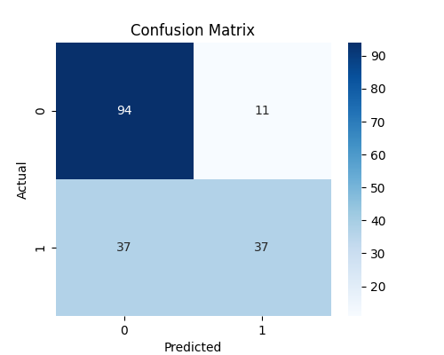

# 🚢 Titanic Survival Prediction using Machine Learning

<div align="center">

### **Predicting Passenger Survival with Logistic Regression**


---

### 🌟 End-to-End Machine Learning Classification Project

Predicting the survival of Titanic passengers using **Logistic Regression**, data preprocessing, visualization, and model evaluation.

</div>

---

# 📖 About the Project

The **Titanic Survival Prediction** project is an end-to-end Machine Learning classification project built using **Python** and **Scikit-Learn**.

The objective is to predict whether a passenger survived the Titanic disaster by analyzing passenger information such as age, gender, ticket class, fare, and family details.

This project demonstrates a complete Machine Learning workflow—from data loading and preprocessing to model training, prediction, and evaluation.

---

# 🎯 Objectives

* Build a Machine Learning Classification Model
* Perform Data Exploration and Analysis
* Train a Logistic Regression Model
* Evaluate Model Performance
* Visualize Results using a Confusion Matrix
* Understand the End-to-End ML Pipeline

---

# 📂 Dataset

**Dataset:** Titanic Dataset

### Input Features

* PassengerId
* Pclass
* Sex
* Age
* SibSp
* Parch
* Fare
* Embarked

### Target Variable

| Value | Meaning         |
| ----- | --------------- |
| 0     | Did Not Survive |
| 1     | Survived        |

---

# 🛠️ Tech Stack

* 🐍 Python
* 📊 Pandas
* 🔢 NumPy
* 📈 Matplotlib
* 🎨 Seaborn
* 🤖 Scikit-Learn
* 📓 Jupyter Notebook
* 🌐 Git & GitHub

---

# ⚙️ Project Workflow

```text
Load Dataset
      │
      ▼
Data Exploration
      │
      ▼
Data Preprocessing
      │
      ▼
Feature Selection
      │
      ▼
Train-Test Split
      │
      ▼
Logistic Regression
      │
      ▼
Prediction
      │
      ▼
Model Evaluation
      │
      ▼
Confusion Matrix
```

---

# 📊 Model Performance

| Metric    | Score        |
| --------- | ------------ |
| Accuracy  | ⭐ **73.18%** |
| Precision | **0.74**     |
| Recall    | **0.70**     |
| F1 Score  | **0.72**     |

---

# 📈 Confusion Matrix

<p align="center">



</p>

---

# 📑 Classification Report

| Class | Precision | Recall | F1 Score |
| ----- | --------- | ------ | -------- |
| 0     | 0.72      | 0.90   | 0.80     |
| 1     | 0.77      | 0.50   | 0.61     |

---

# 📁 Project Structure

```text
Basic-ML-Model
│
├── data/
│   └── cleaned_dataset.csv
│
├── notebooks/
│   └── ml_model_implementation.ipynb
│
├── docs/
│   ├── confusion_matrix.png
│   └── summary_report.pdf
│
├── README.md
└── requirements.txt
```

---

# 🎓 Learning Outcomes

During this project, I learned:

* Data Cleaning
* Data Visualization
* Feature Selection
* Logistic Regression
* Model Evaluation
* Confusion Matrix Analysis
* Classification Report
* Git & GitHub Workflow

---

# 🚀 Future Improvements

* 🌳 Random Forest
* ⚡ Decision Tree
* 🚀 XGBoost
* 📈 ROC Curve
* 🤖 Hyperparameter Tuning
* 🌐 Streamlit Deployment

---

# 👩‍💻 Author

## **Raunak Kumari Gupta**

🎓 **B.Tech – Computer Science Engineering (AI & ML)**

💡 Passionate about **Machine Learning, Data Science, Artificial Intelligence, and Full-Stack Development**

🔗 **GitHub:** https://github.com/kumariraunak-creator

---

<div align="center">

### ⭐ If you found this project helpful, please consider giving it a Star!

**Thank you for visiting my repository ❤️**

</div>
